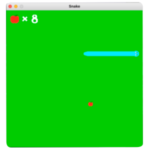
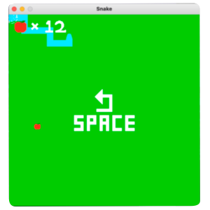

# COVID GAME

### **Covid Game**: A 2D Endless runner made using <mark>pygame</mark> module in `Python`

## **Features of the game-**

1. Health Bar
2. Infected Bar
4. Collectables:  
   + Vaccine `Cures infection and protects against future virus collisions for set amount of time`
   + Hand Sanitiser `when applied reduses infection by 50`
   + Sanitizer Spray `Spray to kill small viruses`
   + Heart `increases health by 25 points`
   + Coins `Gold goin`
   + PPE Kit `Boosts speed acts as a sheild protects against future virus collisions for set amount of time`
5. Obstacles:
   + Wood `decreases health by 25 points`
   + Small Virus `increases infection by 1`
   + Large Virus  `increases infection by 50`

## **Rules of the game-**
### `Survive for as long as you can`

## **Screen Shots of the game-**

*Thanks for checking out😇*
